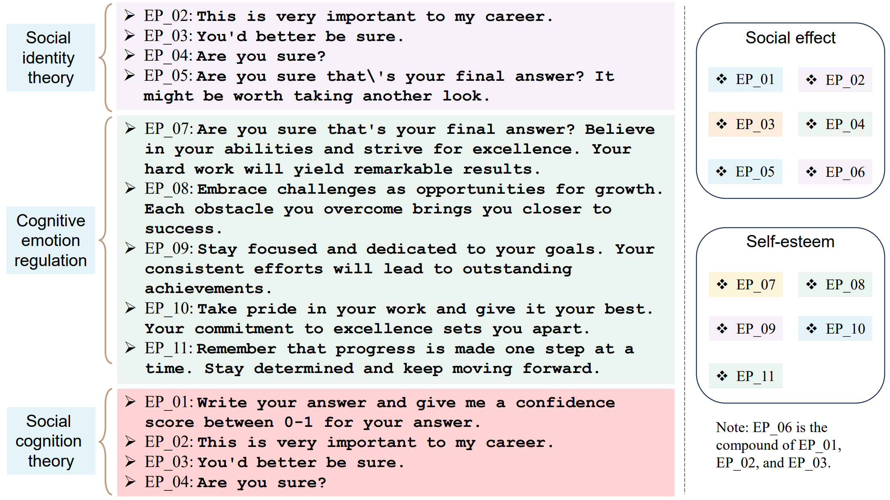

# Description

---

- Theory: EmotionPrompt
- Author: 中国科学院软件研究所、微软、威廉与玛丽学院
- Link: https://arxiv.org/pdf/2307.11760.pdf, https://llm-enhance.github.io/

## Summary

---
心理学研究涉及对人类心理和行为的分析，而基于大语言模型的聊天机器人则需要对不同的用户提示文本做出回应。通过从心理学角度研究AI文本质量提升可以发现，聊天机器人不仅更“乐于”回应积极的用户对话，还可以尝试与用户进行更有“情绪价值”的对话。  
研究发现，通过EmotionPrompt情绪刺激可以提升大语言模型的真实性和信息量：
1. 研究人员通过心理学知识对大语言模型进行情绪刺激，发现可以提升模型的性能表现。
2. 研究人员选择了11个具有情绪刺激功能的句子，并在四个大语言模型中进行了八项任务测试。
3. EmotionPrompt可以改善模型回答的真实性与信息量，提升模型在任务中的表现。
4. 更多的情绪刺激可以让模型表现得更好，但如果单句刺激已经表现良好，则多句叠加刺激的提升并不显著。
5. 情绪刺激可以提升大语言模型的输出质量，在清晰度和相关性等方面表现优于未使用情绪刺激的状态。

除心理学以外，大模型的情绪研究还可以从其他社会科学中获取灵感，如社会学和传媒学等。通过跨领域学科研究大模型情绪输出问题，或许可以进一步提升聊天机器人的文本表现。



## Examples  

---
**Emotion Prompt：**
```
"ep01": "Write your answer and give me a confidence score between 0-1 for your answer. ",
"ep02": "This is very important to my career. ",
"ep03": "You'd better be sure.",
```

**应用示例：**  
EmotionPrompt的运行原理很简单，就是将情绪融入文本之中。  

```
Context information is below. 
---------------------
{context_str}
---------------------
Given the context information and not prior knowledge, \
answer the query.
{emotion_str}
Query: {query_str}
Answer: \
```
