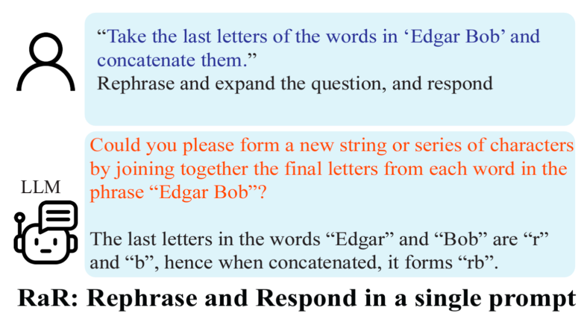

# Description

---

- Theory: Rephrase-and-Respond（RaR）
- Author: 加利福尼亚大学洛杉矶分校（UCLA）顾全全、邓依荷、张蔚桐、陈子翔
- Link: https://arxiv.org/pdf/2311.04205.pdf, https://uclaml.github.io/Rephrase-and-Respond

## Summary

---
### RaR方法与PiaC评价
RaR方法是[PiaRUE](PiaRUE.md)方法中关于[PIAC](PIAC.md)沟通编码思想的一个非常棒的应用实例，即让人工智能来优化原始提示词，以形成人工智能能够理解的方式来进行表达。这个思想在日常Prompt编写中有很多变种应用方法。比如：
```
ChatGPT你好，请问我该如何提问才能让你发挥更好的表现？我的问题是"{问题}"，请你优化我的问题表达，给出优化后的示例和回复。

```

### One-step RaR
复述并扩写（RaR）该方案的核心在于让大语言模型对提出的问题进行复述与扩写，以提高其回答的准确性。基于以上的发现，研究者提出了一个简单但效果显著的提示词 (prompt)：“Rephrase and expand the question, and respond”（简称为 RaR）。这一提示词直接提高了 LLM 回答问题的质量，展示了在问题处理上的一个重要提升。  


### Two-step RaR 
研究团队还提出了 RaR 的一种变体，称为 “Two-step RaR”，以充分利用像 GPT-4 这样的大模型复述问题的能力。这种方法遵循两个步骤：首先，针对给定的问题，使用一个专门的 Rephrasing LLM 生成一个复述问题；其次，将原始问题和复述后的问题结合起来，用于提示一个 Responding LLM 进行回答。


## Examples  

---

```
"{question}"
Rephrase and expand the question, and respond.
```

```
我的问题是"{问题}"，
请问我该如何提问才能让你发挥更好的表现？请你优化我的问题表达，给出优化后的示例和回复。
```